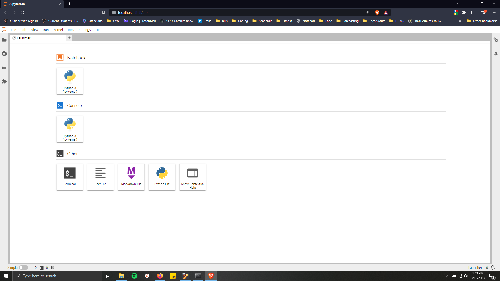

# Data Science Tools for Python -- Installation

Please ensure you have enough time and disk space to complete the installation. The installation may take more or less time depending on your internet speed and familiarity with installing Python package managers and libraries.

**Time to complete:** 30-60 minutes
**Disk space needed:** 3-5 gigabytes (GB)

### Download Miniconda3
Download an installer for Miniconda3, a package manager for Python libraries. Click the link below that corresponds to the operating system you are using. Select the first option from the list for a 64-bit installation with Python 3.10.

* **Windows:** https://docs.conda.io/en/latest/miniconda.html#windows-installers
* **Mac:** https://docs.conda.io/en/latest/miniconda.html#macos-installers
* **Linux:** https://docs.conda.io/en/latest/miniconda.html#linux-installers

Windows users will download the first Python 3.10 item in the table, which is an `.exe` (executable) file.

Most Mac users will download the second item under Python 3.10, which is a `.pkg` file. If you have a newer Mac with M1 ARM architecture, download the fourth item, also a `.pkg` file, under Python 3.10.

### Install Miniconda3

Navigate to the folder where the installer was downloaded. Double-click the installer, which is named something like `Miniconda3-latest-[yourOS]-x86_64.[exe, pkg]`, to install Miniconda3. Selecting the default options for installation should work for most users.

### Install Python libraries

##### Launch a command window.

* **Windows**: type "Anaconda Prompt" into your search bar at the bottom left of the taskbar. Select the "Anaconda Prompt" desktop application.
* **Mac/Linux**: open a terminal window.

See "Starting conda" for further details: https://conda.io/projects/conda/en/stable/user-guide/getting-started.html#starting-conda

##### Install the libraries we need for the workshop

Installing Python libraries with conda may take awhile and will work best with a fast internet connection.

* **Windows:** type `chdir Desktop` into the Anaconda prompt and press enter.
* **Mac/Linux:** type `cd Desktop` and press enter.
* Place the `environment.yml` file on your Desktop (Windows) or in your home directory (Mac/Linux)
* Create an environment and install the required libraries by typing the following command and pressing enter:
    `conda env create -f environment.yml`
* Conda will prompt you for permission to download and install the requested libraries. Type `y` and press enter to confirm.

##### Check that the environment works

* Activate the environment using the following command:
    `conda activate data_science`
* Try launching a jupyter lab instance with the following command:
    `jupyter lab`
  which will open a browser window. You should see an interface in your browser similar to what is shown below.

